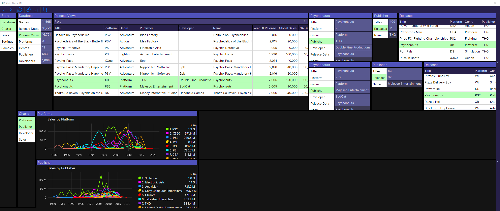

# VideoGamesDB
---
VideoGamesDB is a sample application using the [SideScroll](https://github.com/SideScrollUI/SideScroll) UI framework for AvaloniaUI. 

# SideScroll
* .NET Cross Platform UI Framework that can run on any Windows, MacOS, or Linux system
* Follow multiple tabs 20 or more levels deep. New tabs will load as you scroll to the right
* Previous selections are used to automatically select the most likely options
* Create Links to share views with others
* DataRepos manage your local saving & loading

#### Light Theme

#### Dark Theme

* [Setup](Docs/Setup.md)
* [SideScroll Library](https://github.com/SideScrollUI/SideScroll)

## License
---
MIT